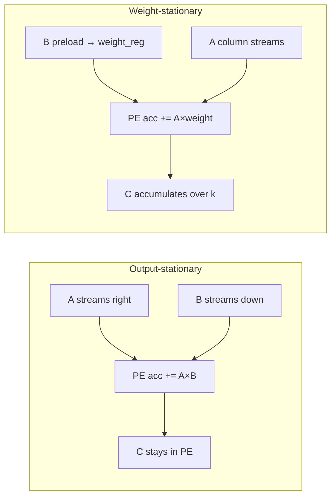

# Output-Stationary vs Weight-Stationary Systolic GEMM

**Author:** Harshil Gor  
**Project:** TensorMesh-16  
**Date:** July 2026

A technical write-up on the dual dataflow modes implemented in TensorMesh-16 — why both exist, how they work at the cycle level, and what trade-offs they expose for INT16 neural-network inference.

**Related docs:** [ARCHITECTURE.md](ARCHITECTURE.md) · [VERIFICATION.md](VERIFICATION.md) · [SYNTHESIS.md](SYNTHESIS.md)

---

## 1. Executive summary

General matrix multiply (GEMM), **C = A × B**, dominates compute in transformer and CNN inference. Hardware accelerators rarely implement GEMM as nested software loops; they use **systolic arrays** — grids of multiply-accumulate (MAC) processing elements (PEs) that stream operands while reusing local registers.

TensorMesh-16 implements a **16×16 systolic mesh** (256 PEs) with a runtime-selectable dataflow:

| Mode | Enum | Idea | 16×16 cycles (approx.) |
|------|------|------|--------------------------|
| **Output-stationary (OS)** | `MODE_OUTPUT_STATIONARY` | Partial sums stay in PE accumulators; A and B stream through the mesh | **~63** |
| **Weight-stationary (WS)** | `MODE_WEIGHT_STATIONARY` | B weights lock into PE registers; A columns stream per k-slice | **~1009** |

Both modes produce **bit-identical INT16 GEMM results** — verified by 1,700+ randomized trials plus OS/WS cross-checks ([VERIFICATION.md](VERIFICATION.md)). The cycle-count gap is not a bug; it reflects **different operand delivery schedules** and the architectural question: *when do you pay to move weights vs activations?*

---

## 2. Why GEMM needs a systolic array

For an **N×N** GEMM with INT16 operands, a naive scalar implementation performs **N³** multiply-adds. A systolic array maps this onto **N² PEs** so that:

1. Each MAC happens locally inside a PE (short wires, high density).
2. Operands **flow** between neighbors instead of being fetched from memory every cycle.
3. Partial sums **accumulate in place** rather than round-tripping to SRAM.

Google's TPU (Jouppi et al., ISCA 2017) popularized this pattern for inference: a large array of INT8/INT16 MACs, on-chip activation buffers, and a controller that skews operand injection so inner products line up in space and time.

TensorMesh-16 is a research-scale version of the same idea: one mesh, two dataflow policies, cycle-accurate verification, and a path to synthesis signoff.

---

## 3. Mesh topology

```
        B[0][*]  B[0][*]  B[0][*]  ...   (top injection, flows down)
           ↓       ↓       ↓
A[*][0] → PE₀₀ → PE₀₁ → PE₀₂ → ...    (A flows right)
A[*][1] → PE₁₀ → PE₁₁ → PE₁₂ → ...
A[*][2] → PE₂₀ → PE₂₁ → PE₂₂ → ...
  ...
```

Each **PE(i,j)**:

- Receives **A** from the left (or left-edge injection).
- Receives **B** from above (or top-edge injection).
- Forwards **A** right and **B** down.
- Maintains a **48-bit accumulator** (holds worst-case sum of 16 INT16×INT16 products).

In **OS mode**, operands meet at PE(i,j) on cycle **i + j + k** for each inner index **k**. In **WS mode**, **B[k][j]** is preloaded into `weight_reg` once per k-slice; **A[i][k]** streams down row i and multiplies the stationary weight.

---

## 4. Output-stationary (OS) dataflow

### 4.1 Concept

**Output-stationary** means the **partial sum for C[i][j] remains in PE(i,j)**. Operands pass through; the accumulator never moves.

For each k ∈ [0, N):

- Inject **A[i][k]** into row i at cycle **i + k**
- Inject **B[k][j]** into column j at cycle **j + k**
- At PE(i,j), when both operands are valid, compute **acc += A[i][k] × B[k][j]**

### 4.2 Skewed injection (4×4 example)

From `python scripts/show_systolic_timing.py --size 4`:

```
cycle | row0 row1 row2 row3  ||  col0 col1 col2 col3
------+-----------------------------------------------+
    0 |  A00   .    .    .   ||   B00   .    .    .
    1 |  A01  A10   .    .   ||   B10  B01   .    .
    2 |  A02  A11  A20   .   ||   B20  B11  B10   .
    3 |  A03  A12  A21  A30  ||   B30  B21  B20  B03
  ...
```

The diagonal wavefront ensures **A[i][k]** and **B[k][j]** arrive at PE(i,j) on the same cycle.

### 4.3 Cycle count

| Phase | Cycles |
|-------|--------|
| Active compute | **3N − 1** |
| Drain partial results | ~N |
| **Total (N=16)** | **~63** |

At 100 MHz, one 16×16 INT16 GEMM completes in **~630 ns**.

### 4.4 Strengths and costs

**Strengths**

- Minimum latency for a single GEMM on a fixed mesh size.
- Simple controller: one `S_RUN` pass, no outer k-loop.
- High MAC utilization once the wavefront fills the array.

**Costs**

- **B matrix is re-streamed** across the mesh for every k — high vertical bandwidth during compute.
- Operand skew logic grows with N (manageable at N=16).

**Best for:** Dense layers, one-shot GEMM, latency-bound inference where B is not reused across many subsequent operations on the same PE weights.

---

## 5. Weight-stationary (WS) dataflow

### 5.1 Concept

**Weight-stationary** keeps **B[k][j]** (the weight) in a local **`weight_reg`** inside each PE. Activations **A[i][k]** stream past stationary weights.

TensorMesh-16 implements WS as a **K-step outer loop** (k = 0 … N−1):

```
for k in 0..N-1:
    PRELOAD: stream B[k][0..N-1] down columns → latch into weight_reg
    RUN:     stream A[0..N-1][k] across rows → acc += A[i][k] * weight_reg[i][j]
    (accumulators are NOT cleared between k iterations)
```

### 5.2 Why an outer loop?

True WS in production chips often overlaps preload with compute from the previous slice. TensorMesh-16 uses an explicit **S_PRELOAD → S_RUN** FSM per k for clarity and verifiability:

```systemverilog
// rtl/systolic/systolic_gemm.sv — state machine excerpt
typedef enum logic [2:0] { S_IDLE, S_CLEAR, S_PRELOAD, S_RUN, S_DRAIN, S_DONE } state_t;
assign mesh_preload_weight = (state == S_PRELOAD) && (dataflow_mode == MODE_WEIGHT_STATIONARY);
```

```systemverilog
// rtl/systolic/pe.sv — WS MAC uses latched weight
if ((dataflow_mode == MODE_WEIGHT_STATIONARY) && preload_weight && b_valid)
    weight_reg <= b_in;
// ...
if (!preload_weight && a_valid && weight_valid)
    acc_r <= acc_r + a_in * weight_reg;
```

### 5.3 Cycle count

Per k-slice:

| Phase | Cycles |
|-------|--------|
| Preload B[k][:] | **2N − 2** |
| Run A[:][k] | **2N − 2** |
| **Per k** | **4N − 4** |

For N=16, k=16: **(4×16 − 4) × 16 ≈ 960** + drain ≈ **~1009 total**.

At 100 MHz: **~10.1 µs** per 16×16 GEMM — roughly **16× slower** than OS for this mesh size.

### 5.4 Strengths and costs

**Strengths**

- **Weights move once per k-slice** into `weight_reg`, then activations stream — models CNN conv layers where filter weights are reused across spatial positions.
- Lower **B-bandwidth** during the RUN phase (B already local).
- Pedagogically demonstrates the same knob Google/Graphcore/others tune in real TPUs.

**Costs**

- Much higher **cycle count** for full GEMM on a small N×N mesh (outer k-loop × slice length).
- More FSM complexity (`S_PRELOAD`, `k_index`, mode mux in controller).
- Extra register per PE (`weight_reg`).

**Best for:** Layers with **weight reuse** (conv filters, depthwise kernels), studies where memory energy dominates, or architectures that amortize preload over many activation vectors.

---

## 6. Side-by-side comparison



| Dimension | OS | WS |
|-----------|----|----|
| **What stays local** | Partial sum C[i][j] | Weight B[k][j] in `weight_reg` |
| **What streams** | Both A and B (skewed) | A activations per k-slice |
| **Controller** | Single pass | K-step preload + run |
| **Cycles (N=16)** | ~63 | ~1009 |
| **B bandwidth in compute** | High (re-stream each k) | Low (preloaded) |
| **PE extra state** | None | `weight_reg` + `weight_valid` |
| **Numerical result** | Identical (verified) | Identical (verified) |

---

## 7. Memory bandwidth narrative

TensorMesh-16 has four on-chip SRAM banks ([ARCHITECTURE.md](ARCHITECTURE.md) §4.4):

| Bank | Matrix | Width |
|------|--------|-------|
| A | Activations / left operand | 16-bit |
| B | Weights / right operand | 16-bit |
| C | Raw GEMM output | 48-bit |
| D | Post-activation | 16-bit |

### OS mode bandwidth profile

During `S_RUN`, the controller injects both a row of A and a column of B every cycle (with skew). For large N, **B is read N times** from the perspective of the full inner product — it flows through the mesh repeatedly.

### WS mode bandwidth profile

For each k:

1. **Preload:** Read one row of B (`B[k][0..N-1]`) and distribute down columns — **N elements of B per k**.
2. **Run:** Stream one column of A (`A[0..N-1][k]`) — **N elements of A per k**.

Over the full GEMM, both modes read **N² elements of A and N² elements of B** from SRAM. The difference is **when** those reads happen relative to compute and whether B transits the mesh fabric on every inner-product step. WS shifts traffic from the **mesh interconnect** to **local PE registers** — the same trade-off real accelerators make when weight reuse is high.

---

## 8. Mapping to neural-network layers

| Layer type | Typical pattern | Favorable dataflow |
|------------|-----------------|-------------------|
| Fully-connected / MLP | One large GEMM per layer | **OS** (latency, simplicity) |
| Conv2D (im2col) | Many GEMMs or direct conv | **WS** (filter reuse) |
| Transformer attention Q×Kᵀ | Tall-skinny GEMMs | Depends on tiling; OS for single-shot tiles |
| Depthwise separable conv | Per-channel weights | **WS** |

TensorMesh-16 exposes `dataflow_mode` as a **2-bit runtime signal** on `systolic_gemm` and `systolic_accel` — the same class of control bit found in research TPUs and configurable dataflow accelerators (cf. Samajdar et al., "SCALE-Sim" for dataflow modeling).

---

## 9. Implementation highlights

### 9.1 Shared PE, dual behavior

One PE module serves both modes via `dataflow_mode` and `preload_weight`:

- **OS:** MAC when `a_valid && b_valid` (both operands streaming).
- **WS:** Latch B during preload; MAC when `a_valid && weight_valid` during run.

No duplicate mesh — only control and per-PE state differ.

### 9.2 Verification strategy

| Layer | Method |
|-------|--------|
| Algorithmic golden | `matmul_reference()` — O(N³) software GEMM |
| Cycle-accurate model | `SystolicModel` in `verify/golden_systolic.py` |
| RTL simulation | `tb/systolic/systolic_gemm_tb.sv` — OS and WS |
| Randomized regression | 1,700+ trials, OS ≡ WS ≡ reference |
| Synthesis | Yosys cell counts; gate-level cosim on MAC primitives |

Key regression assertion:

```python
# verify/test_random_systolic.py
assert sim_os == ref
assert sim_ws == ref
assert sim_os == sim_ws  # cross-mode agreement
```

### 9.3 Throughput snapshot (OS, N=16, 100 MHz)

- MAC ops per GEMM: N³ = **4,096**
- Cycles: ~**63**
- Throughput: 4,096 / 63 ≈ **65 MACs/cycle** ≈ **6.5 GOPS**

WS throughput on the same clock: 4,096 / 1009 ≈ **4.1 MACs/cycle** ≈ **0.41 GOPS** — but remember WS models a **different memory/compute scheduling policy**, not a strict apples-to-apples throughput contest on one fixed GEMM.

---

## 10. Design lessons (portfolio takeaways)

1. **Dataflow is a first-class architecture decision** — the same PE mesh, wires, and SRAM can behave very differently depending on what you hold stationary (outputs vs weights).

2. **Cycle count ≠ memory efficiency** — OS wins latency on TensorMesh-16; WS wins the *story* of weight reuse and is how conv-heavy workloads are often mapped in industry.

3. **Verify both paths against one golden** — OS/WS cross-check caught schedule bugs early; 1,700 randomized matrices give confidence beyond hand-picked tests.

4. **Keep the controller readable** — explicit `S_PRELOAD` / `S_RUN` / `k_index` in WS trades some performance for debuggability — appropriate for architecture research.

5. **Scale changes the winner** — on larger arrays with overlapped preload and tiled GEMMs, WS cycle penalty amortizes; TensorMesh-16 at N=16 exaggerates the gap to make the trade-off visible.

---

## 11. Reproducing this analysis

```powershell
# Timing diagrams (4×4 readable, 16×16 full)
python scripts/show_systolic_timing.py --size 4
python scripts/show_systolic_timing.py --size 16 --waves

# Randomized OS/WS verification
python -m pytest verify/test_random_systolic.py -v

# RTL simulation both modes
.\scripts\run_sim.ps1 systolic_gemm

# Full stack
.\scripts\run_all.ps1
```

---

## 12. References

1. N. P. Jouppi et al., *"In-Datacenter Performance Analysis of a Tensor Processing Unit,"* ISCA 2017.
2. H. T. Kung & C. E. Leiserson, *"Systolic Arrays for VLSI,"* 1979.
3. A. Samajdar et al., *"SCALE-Sim: Systolic CNN Accelerator Simulator,"* 2018.
4. J. L. Hennessy & D. A. Patterson, *Computer Architecture: A Quantitative Approach,* 6th ed.
5. TensorMesh-16 source: [github.com/harshilgor/AI-accelerator-hardware-](https://github.com/harshilgor/AI-accelerator-hardware-)

---

## Appendix A — PE meet-time formula

For OS mode, operands **A[i][k]** and **B[k][j]** meet at PE(i,j) on cycle:

\[
t_{\text{meet}}(i, j, k) = i + j + k
\]

Run length until last meet (k = N−1, i = N−1, j = N−1):

\[
t_{\text{last}} = (N-1) + (N-1) + (N-1) = 3N - 3
\]

Controller uses **3N − 1** active ticks plus drain — matching `run_len = 3 * SIZE - 1` in `systolic_gemm.sv`.

## Appendix B — WS slice length

Skewed preload/run along one row or column takes **2N − 2** cycles for the wavefront to traverse the edge PEs — matching `slice_len = 2 * SIZE - 2` in RTL and `ws_slice_len()` in the golden model.

---

*TensorMesh-16 — Harshil Gor*
